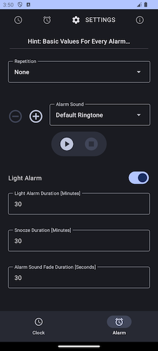
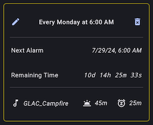

Gentle Light Alarm Glock (GLAC)
===============================

## Preview

| Default Clock                       | Alarms                                | Clock Settings                                       | Alarm Settings                                       |
|-------------------------------------|---------------------------------------|------------------------------------------------------|------------------------------------------------------|
|  |  |  |  |

## Clock Theme Examples
| Portrait                                     | Landscape                                     | Comments                                                                                                                                                              |
|----------------------------------------------|-----------------------------------------------|-----------------------------------------------------------------------------------------------------------------------------------------------------------------------|
|  |  | - Font: Abril Fatface - No Dividers - No Seconds - No Daytime Marker                                                                                      |
|  |  | - Font: Antic Didone - Dashed Line Dividers (2 were colored as background), Size: 100% - Downsized Daytime Marker                                             |
|  |  | - GLAC 7-Segment Display - Medium, Reverse Italic - All Segments were colored differently - Dotted LineDividers (2 were colored as background), Size: 75% |

## What is GLAC?
At first glance, GLAC is a simple light alarm clock application.
The special thing about GLAC is that, compared to a number of other alarm clocks, it tries to give users more options to make “waking up” and “getting up” at a certain, possibly biorhythmically unfavorable time, friendly and gentle. This also includes giving the clock, which must be as simple and easy to read as possible, a pleasant shape and color.

## Overview
Of course, everyone has different ideas about what it means to be woken up gently or how easy it is to read a clock and whether you need such options at all.

When using GLAC, you have several options to determine the way you want to be woken up.

There are several ways to use GLAC, but for the sake of simplicity, here is an overview of how GLAC works and is commonly used.

1. Start GLAC, navigate to the alarms screen and set one or more alarms
2. Switch back to the clock in full screen mode and leave GLAC open*
3. Place the Android device (possibly also an older, discarded device from Android 8.0) on which GLAC is running, within easy reach next to the bed and connect it to a power supply unit (recommended)
4. Sleep ... 
5. 30 minutes (default, customizable) before the set alarm time, GLAC starts an “artificial sunrise”** (light alarm, without alarm sound)
6. At the set alarm time, the “artificial sunrise” is finished and the set alarm tone sounds as quietly as possible at first, then gradually increases to the loudest level within 30 seconds (default, customizable)
7. As soon as the light alarm has started, you have the option of stopping the alarm or “snoozing” for another 30 minutes (default, customizable), whereby an indicator in the upper left corner shows that a “snooze” alarm is active (“snooze” can be repeated several times as desired)
8. A “snooze” alarm can be canceled at any time, provided you wake up beforehand and want to get up (a dialog appears when clicking on the clock in full screen mode while a “snooze” alarm is active)
9. (Optional) Alarm default values can be customized according to your own preferences
10. (Optional) Shape and color of the digital clock can be extensively customized according to your own preferences

### *Leave GLAC open (strongly recommended!)
- For the light alarm clock to be visible at the alarm time, GLAC must be open, and if the clock is in full screen mode (and only then!), GLAC will prevent the screen timeout set by the user in the system and leave the screen on!
- If GLAC is open (and alarms are set) but the clock is **NOT** in full screen mode, the screen timeout will take effect and the screen will switch off accordingly at some point. Then, of course, a light alarm will not be visible, **BUT** the alarm will sound at the set alarm time! However, depending on the system settings, the user may have to unlock the device before the alarm can be responded to, which can be annoying when you are tired!
- **ATTENTION**: If GLAC is **not** open and alarms are set, **nothing will happen** at the alarm time!!!
  - Expired alarms without repetition are removed the next time GLAC is started.
  - Expired alarms with repetition (daily, weekly, monthly) are set to the next corresponding time in the repetition series.
  - Why? For security reasons, apps that are to be started by the Android system (i.e. not by a user) rightly have to meet a very high hurdle of conditions in order to get an exception permission, which in my opinion is not necessary for the intended functionality of GLAC! (When you need such functionality, I recommend the Android default alarm clock app which is available on every Android system).

### **“Artificial sunrise”
From the deepest blackness of the night, into the blue hour, which transforms into ever brighter blue as it approaches sunrise and shortly afterwards gives way to an intense orange that introduces the golden hour and finally manifests itself in the radiant white of the sun via golden yellow. 
During this color gradient animation, the brightness of the Android device's screen is successively increased from the currently set brightness to the maximum brightness, so that the brightness of a room is as bright as possible (white + max. brightness!) when the alarm sounds.
Despite the limited size of an Android device, the light generated should be sufficient to find your way around the room without having to switch on a light that may be perceived as dazzling when you are tired.

## Documentation
### Alarm sounds
- A few very special selected sounds are included (prefix: “GLAC_” / see about screen for details)
- All ringtones available on the user's device can be used
- Import any audio file (must be available on the user's device and be an audio format supported by Android!)

### Alarm basic values (basic values for newly created alarms)

- Alarm repetition: None (grey border), Daily (red border), Weekly (yellow border), Monthly (green border)
- Alarm sound
- Light alarm on/off
- Light alarm duration: 1-60 minutes (default: 30 minutes)
- Snooze duration: 5-60 minutes (default: 30 minutes)
- Alarm sound fade duration: 0-60 seconds (default: 30 seconds)

### Alarms

- Basic alarm values can be adjusted when scheduling new alarms
  - For example, if you only need a snooze time of 45 minutes for a new alarm, you do not have to change the basic value first...
    - But, as this is likely to be a rarer case, it's hidden in the expandable "More..." box!
- Alarms that have already been set can of course be updated or deleted by hitting edit/delete buttons top left/right
  - 

### Digital clock
- Live preview of changes
  - 
- Theme support
  - 
  - All clock settings are taken into account
  - To add a new theme, simply enter a name and hit the plus button
    - This will always create a new theme based on the current one
  - Every Theme can be reset by hitting the reset button (even the default theme, e.g. if it has been changed by mistake)
- Hours and minutes are always displayed, seconds and daytime marker can optionally be switched on/off independently of each other
  -  
  - If the daytime marker is activated, the hour display changes from 24 hours to 12 hours (e.g. 16:00 changes to 04:00 PM)
- Shape of digits (and daytime marker letters (APM))
  -  
  - Font
    - There are some fonts included that I think are easy to read/exceptional (see about screen for details)
    - All fonts included in the Android system can be used (prefix: “Default”)
    - Import any font (must be available on the user's device)
      - Note: Not all imported fonts will work/look well, but most will!
  - GLAC's own 7-segment display incl. various weights and styles
    - Background modeled on a real 7-segment display can be switched on/off 
      - Note that this option is not visible in screenshot above, because "Font" is selected...
  - Digit/Letter size is automatically set to maximum size depending on the screen size, but can also be adjusted manually
    - Digits and daytime marker independent of each other
      - Note that daytime marker size setting is not visible in screenshot above, because daytime marker is switched off...
- Dividers (between hours<>minutes etc.)
  - 
  - Types
    - No divider
    - Line
    - Dashed line
      - Number of dashes can be adjusted
    - Dotted line
      - Number of dots depends on thickness
    - Dashed-dotted line
      - Number of dots can be adjusted, number of dashes depends on number of dots
    - Colon 
      - Points can be moved
  - Adjustable thickness
  - Adjustable length
  - Line ends: Round or angular
  - Adjustable angle 
    - To be able to adapt dividers in landscape format to an angle of an italic font
    - Note that this option is not visible, because the screenshot above is taken in portrait format!
- Colors
  - 
  - Random color can be generated ('AutoAwesome' icon (3 'stars'))
  - Option to reset a color to default
  - Color input via color hex code (ARGB) or color selector
  - 
  - (Layer 1) Uniform color for
    - Digits/letters
      - Changing this will automatically set dividers color to the same value, to keep uniformity!
    - Background color
    - Dividers
  - (Layer 2) Individual color per digit/letter (e.g. every '3' red, every '5' yellow, etc.)
  - (Layer 3) Individual color per “clock component” (e.g. hours-tens red, seconds-ones yellow, etc.)
    - “Clock components”
      - Hours (tens/ones)
      - Minutes (tens/ones)
      - Seconds (tens/ones)
      - Daytime marker (ante/post/meridiem)
      - Dividers (hours<>minutes / minutes<>seconds (or daytime marker, depending on setting) / seconds<>daytime marker)
  - (Layer 4) Individual color per segment of a 7-segment digit (e.g. middle segment green, segment “bottom left” blue, etc.)
  - Colors can be combined per layer (layer 1 < layer 2 < layer 3 < layer 4)
    - E.g. settings for 7-segment display: All digits light gray, each '3' red, seconds-ones yellow, middle segment green
      - Result: All digits are light gray (layer 1), but additionally every '3' is red (layer 2), seconds-ones are always yellow (also '3') (layer 3) and all middle segments are green (layer 4) 
      - 
- Brightness
  - 
  - The screen brightness that a user has set for their device (system brightness) can be ignored
    - Instead, an individual value can be set which is used exclusively(!) in the fullscreen clock!
      - If you navigate to any other screen (incl. “non-fullscreen” clock!) or exit GLAC, the system brightness is used again
    - Scenario
      - This allows you to set the screen brightness very low and save power when using GLAC at night or in a dark environment (normal case)
        - No need to care about manually reset brightness after using GLAC's fullscreen clock 
      - It is advantageous here if the clock is set to a high-contrast setting and is therefore easy to read
      - This is of course most useful when using OLED screens, but LCDs also benefit from this!

#### 7-segment weights and styles
##### Weights
| Thin                                        | Extra Light                                              | Light                                         | Regular                                           |
|---------------------------------------------|----------------------------------------------------------|-----------------------------------------------|---------------------------------------------------|
|  |  |  |  |

| Medium                                          | Semi Bold                                            | Bold                                        | Extra Bold                                             |
|-------------------------------------------------|------------------------------------------------------|---------------------------------------------|--------------------------------------------------------|
|  |  |  |  |

| Black                                         | 
|-----------------------------------------------|
|  | 

##### Styles
Note that the following styles are applied to regular weight, but of course they can be applied to every other weight as well!

| Italic                                                  | Reverse Italic                                                          | 
|---------------------------------------------------------|-------------------------------------------------------------------------|
|  |  |

Outline size is adjustable, examples below have 2 pixels applied.

| Outline                                                   | Outline Italic                                                          | Outline Reverse Italic                                                                  |
|-----------------------------------------------------------|-------------------------------------------------------------------------|-----------------------------------------------------------------------------------------|
|  |  |  |

## Miscellaneous
- GLAC is “Free Open Source Software” (FOSS)
- GLAC works completely offline
- GLAC supports adaptive design
- Dark/Light Mode setting of the Android system is taken into account

## External Libraries
Many thanks to all the authors for their outstanding, freely available libraries, without which I would have had to invest much more time in completing GLAC!
- [ColorPicker Compose](https://github.com/skydoves/colorpicker-compose) by [Jaewoong Eum (skydoves)](https://github.com/skydoves)
- [Jetpack Compose Extended Colors](https://github.com/SmartToolFactory/Compose-Extended-Colors) by [Smart Tool Factory](https://github.com/SmartToolFactory)
- [International Components for Unicode (ICU)](https://icu.unicode.org/) by Unicode Consortium
